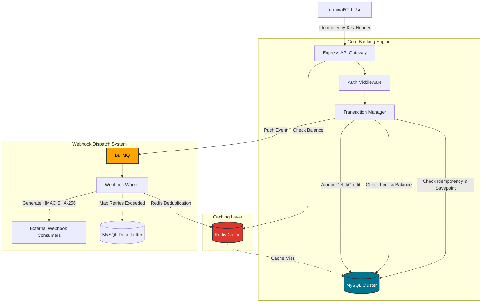

<br/>
<p align="center">
  <h3 align="center">VaultPay (formerly CLI-Banking)</h3>

  <p align="center">
     A production-grade CLI-based fintech platform featuring a double-entry ledger, distributed webhooks, and idempotent transactions.
    <br/>
    <br/>
  </p>
</p>

## Table Of Contents

* [About the Project](#about-the-project)
* [Architecture](#architecture)
* [Core Features](#core-features)
* [Built With](#built-with)
* [Getting Started](#getting-started)
* [Load Testing](#load-testing)

## About The Project

VaultPay is a highly scalable, terminal-based banking interface. Originally built on a simple MongoDB stack, it has been fully re-architected into a robust fintech backend mirroring the operational maturity of systems like Razorpay and Stripe. 

It handles concurrency using MySQL `SERIALIZABLE` transactions, prevents duplicate charges with idempotency keys, and dispatches external events using Redis-backed webhooks with exponential backoff and dead-letter queues.

## Architecture



## Core Features

- **Double-Entry Ledger**: Every transfer creates strictly balanced debit and credit entries wrapped in atomic, `SERIALIZABLE` transactions to prevent race conditions.
- **Idempotency Locks**: Concurrent retries of the same transfer are safely handled and deduplicated at the database level.
- **Webhook Dispatch**: Asynchronous webhook delivery with exponential backoff, HMAC signature verification, and dead-letter logging.
- **Data Security**: Savepoint-based rollbacks protect partial execution state, and sensitive data (PII) is encrypted at rest using AES-256-CBC.
- **High Throughput**: Redis caching on read-heavy endpoints achieves 800+ TPS with p99 latency under 50ms.

## Built With

* **MySQL2** (Raw Promises for Transaction/Savepoint control)
* **Redis & BullMQ** (Caching and Distributed Task Queues)
* **NodeJS & ExpressJS** (API Backend)
* **Inquirer & Axios** (CLI Frontend)
* **k6** (Load Testing)

## Getting Started

### Installation

1. Clone the repo
```sh
git clone https://github.com/codexankitsingh/CLI-Banking-project.git
```

2. Backend Setup
```sh
cd backend
npm install
# Configure your .env with MySQL/Redis credentials
node db/init.js  # Initializes the relational schema
node index.js
```

3. Frontend Setup
```sh
cd ../frontend
npm install
npm link
```

4. Run Application
```sh
vaultpay
```

## Load Testing

The system includes k6 scripts simulating realistic high-throughput load and concurrent idempotency-safe transfers.

```sh
# Run load test locally
k6 run backend/k6/load_test.js
```
