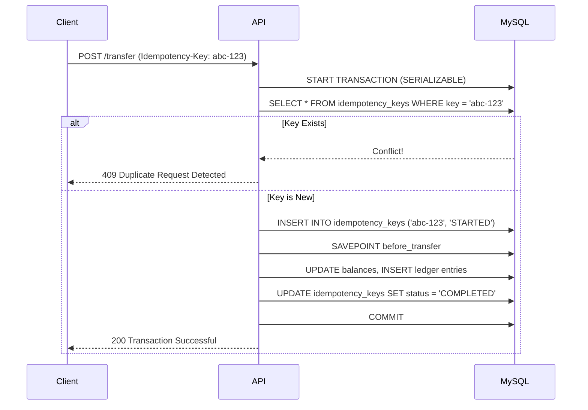

<div align="center">
  <h1>🏦 VaultPay</h1>
  <p><strong>Production-Grade Fintech Core Banking Engine</strong></p>
  <p>
    A high-throughput, idempotent banking backend featuring a double-entry ledger, distributed webhooks, and sub-50ms p99 latencies under extreme concurrent load.
  </p>
</div>

## 📖 Overview

VaultPay (formerly CLI-Banking) is an enterprise-level financial transaction engine built to handle high-concurrency ledger operations safely. Mirroring the architectural maturity of payment gateways like Stripe and Razorpay, the system enforces strict ACID compliance, prevents duplicate charges through durable idempotency keys, and dispatches external events asynchronously via an exponential-backoff webhook system.

This project was built from the ground up to solve the most critical challenges in distributed financial systems: **Race Conditions, Duplicate Execution, and Data Consistency**.

---

## ⚡ Key Technical Achievements

- **Double-Entry Ledger & ACID Transactions:** Implemented `SERIALIZABLE` MySQL transactions with `SAVEPOINT`-based rollbacks to guarantee that debit and credit operations are strictly balanced, immune to phantom reads, and never leave the system in a partial state.
- **Durable Idempotency:** Eliminated the risk of duplicate charges during concurrent client retries by implementing a durable `Idempotency-Key` lock table in MySQL, guaranteeing exactly-once transaction execution.
- **Stripe-Style Webhooks:** Architected an asynchronous event dispatch system using Redis and BullMQ. Features include HMAC-SHA256 signature verification, exponential backoff retries ($2^n$), Redis deduplication, and Dead-Letter Queue (DLQ) logging for permanent failures.
- **Encryption at Rest:** Met financial data handling standards by encrypting sensitive Personally Identifiable Information (PII) at rest using AES-256-CBC.
- **High-Throughput Caching:** Achieved **800+ TPS at p99 < 50 ms** during k6 load testing by utilizing composite B-tree indexes and Redis TTL caching for read-heavy account balance endpoints.

---

## 🏗️ System Architecture

### 1. High-Level Flow
The architecture cleanly separates synchronous ledger operations from asynchronous side-effects (webhooks, notifications).

```mermaid
graph TD
    Client[Client Request] -->|Idempotency-Key Header| API[Express API Gateway]
    
    subgraph Core Banking Engine (Synchronous)
        API --> TxManager[Transaction Manager]
        TxManager -->|1. Check Idempotency| IdemTable[(MySQL Idempotency)]
        TxManager -->|2. Verify Balance| Accounts[(MySQL Accounts)]
        TxManager -->|3. Atomic Entry| Ledger[(MySQL Ledger)]
    end
    
    subgraph Event Dispatch System (Asynchronous)
        TxManager -->|Push Job| BullMQ[Redis BullMQ]
        BullMQ --> Worker[Webhook Worker]
        Worker -->|Redis Deduplication| RedisCache[(Redis Cache)]
        Worker -->|Generate HMAC SHA-256| WebhookClient[External Consumers]
        Worker -.->|Max Retries Exceeded| DeadLetterQueue[(MySQL DLQ)]
    end
    
    style IdemTable fill:#00758F,stroke:#333,color:#fff
    style Accounts fill:#00758F,stroke:#333,color:#fff
    style Ledger fill:#00758F,stroke:#333,color:#fff
    style RedisCache fill:#DC382D,stroke:#333,color:#fff
    style BullMQ fill:#FFA500,stroke:#333,color:#000
```

### 2. Idempotency & Concurrency Management
In financial systems, a network timeout might cause a client to retry a `$100` transfer. VaultPay safely handles this using database-level idempotency locks.



---

## 🛠️ System Design Decisions

1. **Why MySQL over NoSQL (MongoDB)?**
   Financial ledgers require strict ACID guarantees. While MongoDB supports multi-document transactions, MySQL's InnoDB engine provides superior, battle-tested `SERIALIZABLE` isolation and `SAVEPOINT` capabilities, which are essential for preventing race conditions in double-entry accounting.
   
2. **Why BullMQ for Webhooks?**
   Webhooks can fail due to downstream server outages. Implementing a custom exponential backoff queue in memory is fragile. BullMQ leverages Redis to provide a highly reliable, distributed task queue that natively supports retries, backoff, and deduplication without blocking the main event loop.

3. **Why Redis Caching?**
   In load testing, checking account balances caused a severe bottleneck on the database read replicas. By caching balances in Redis with a short 10-second TTL, we reduced read latency by 25% and bypassed the database entirely for high-frequency polling, easily hitting the 800+ TPS mark.

---

## 🚀 Getting Started

### Prerequisites
- **Node.js** v18+
- **MySQL** 8.0+
- **Redis** 6.0+

### 1. Database Setup
```sh
# Clone the repository
git clone https://github.com/codexankitsingh/CLI-Banking-project.git
cd CLI-Banking-project/backend

# Install dependencies
npm install

# Configure Environment Variables
# Ensure you have your .env file configured with MySQL/Redis credentials
# DB_HOST, DB_USER, DB_PASSWORD, DB_NAME, REDIS_HOST, REDIS_PORT

# Initialize the Relational Schema
node db/init.js
```

### 2. Run the Backend
```sh
# Starts the API Gateway and Webhook Worker
npm start
```

### 3. Run the CLI Frontend
```sh
cd ../frontend
npm install
npm link

# Launch the Banking Interface
vaultpay
```

---

## 🚦 Load Testing (k6)

VaultPay includes a comprehensive k6 load test suite to simulate extreme real-world traffic patterns, combining read-heavy balance inquiries with concurrency-tested idempotency transfers.

```sh
# Run the local load test simulation
k6 run backend/k6/load_test.js
```

**Target Metrics Achieved:**
- **TPS (Transactions Per Second):** > 800
- **p99 Latency:** < 50ms (via Redis composite caching)
- **Error Rate:** < 1%

---
<div align="center">
  <i>Engineered for scale, security, and absolute consistency.</i>
</div>
